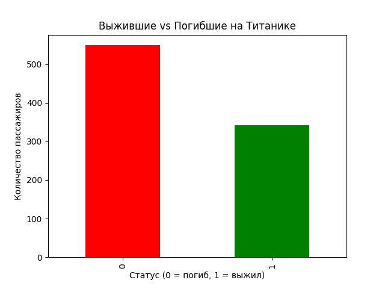

# Titanic Data Analysis

## Описание проекта
Анализ данных пассажиров «Титаника» с использованием Python (pandas, matplotlib).  
Цель — исследовать факторы, влияющие на выживаемость.

## Данные
Источник: стандартный датасет Titanic (открытые данные).  
Файл: `titanic.csv` (891 строка, 12 столбцов).

## Вопросы, на которые я ответил
1. Сколько мужчин и женщин было на борту?  
2. Каков средний возраст пассажиров?  
3. Сколько человек выжило и погибло?  
4. Как класс билета влиял на шанс выжить?

## Инструменты
- Python 3.x  
- pandas — загрузка и обработка данных  
- matplotlib — визуализация

## Результаты
- Выжило 342 человека (38%), погибло 549 (62%)  
- Средний возраст пассажиров — около 30 лет  
- Шанс выжить:  
  - в первом классе — 63%  
  - во втором классе — 47%  
  - в третьем классе — 24%

### График выживаемости

## Как запустить проект
1. Скачайте репозиторий  
2. Установите библиотеки: `pip install pandas matplotlib`  
3. Запустите скрипт: `python script.py`

## Автор
Игорь Сотиков  
[GitHub](https://github.com/Sotichsays)
